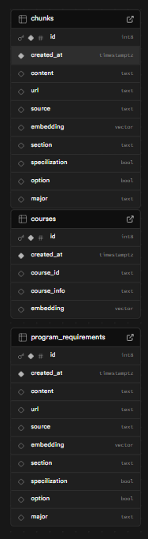

# 🧠 Schedule Verifier
  


---

## 🧠 Overview

This project is your AI-powered co-pilot for navigating Queen’s CS course planning. It combines OCR, LLM reasoning, and a custom RAG pipeline to help students—especially frosh—verify their schedules, understand program requirements, and get answers to major-specific academic questions. Off-topic? The chatbot has a personality and will *gently* troll you back.

## 🚀 Try It Out

👉 [https://queens-schedule-analyzer.netlify.app](https://queens-schedule-analyzer.netlify.app/)

---

## 🔍 Features

- **Agentic Chatbot** – Built with **LangChain**, **OpenAI GPT-4o**, and **DeepSeek**, enabling contextual multi-turn conversations with memory and reasoning
- **Agentic Context Retrieval** – Uses LLMs to dynamically decide what types of context (RAG, structured data, course plans) to retrieve per message
- **Supabase Vector DB** – Custom **cosine similarity** search via `rpc()` function
- **LLM-Orchestrated Data Access** – Course plans, options, and program data queried only when relevant, using structured planning LLMs
- **Document AI Integration (GCP)** – Extracts text from student schedules via OCR
- **LLM-Powered Correction Pipeline** – Fixes formatting and semantic errors in OCR output before validation
- **Schedule Validator** – Automatically flags missing or invalid courses for a student’s specific major and year
- **Vue.js Frontend** – Responsive chat interface with file uploads and real-time feedback
- **Flask Backend** – Handles embeddings, Supabase access, and LLM orchestration logic
- **CI/CD via Render** – Auto-deployments with environment-based secrets for fast iteration and testing


## 🛠️ Technologies Used

### 🧩 Backend
- **Python** – primary backend language
- **Flask** – lightweight API server for chatbot, RAG, and OCR pipelines
- **Supabase** – free Postgres vector DB with custom RPC for similarity + filtering
- **Google Cloud Document AI** – OCR engine for extracting course text from images
- **OpenAI GPT-4o / DeepSeek** – used for reasoning, chunking, and parsing academic data
- **LangChain** – for output schema enforcement, prompt pipelines, and LLM chaining

### 🎨 Frontend
- **Vue.js** – dynamic SPA for chat, upload, and user interaction
- **Vite** – ultra-fast bundler for dev & production

### ⚙️ DevOps
- **Render** – free-tier hosting with GitHub CI/CD integration
- **Netlify** - free-tier hosting with GitHub CI/CD integration
- **.env-based secrets** – secure management of OpenAI, Supabase, and GCP keys

---

## Getting Started (Local Development)

### Prerequisites

- Python 3.10+
- Node.js 18+
- Google Cloud Service Account JSON key
- OpenAI API key

## 🛠️ Backend Setup

To run the backend locally:

1. **Clone the repo** and navigate to the backend directory:

    ```bash
    cd backend
    pip install -r requirements.txt
    ```

2. **Create .env file** with your api keys:
    ```bash
    open_ai_key=your_openai_key
    gcp_project_id=your_gcp_project_id
    gcp_location=your_gcp_location
    gcp_processor_id=your_gcp_document_ai_processor_id
    db_pass=your_database_password
    supabase_url=https://your-project.supabase.co
    supabase_service=your_supabase_service_role_key
    deepseek_key=your_deepseek_api_key
    ```

3. **Setup Python in a virtual environment:**
    ```bash 
    python -m venv venv
    source venv/Scripts/activate  # On Windows
    pip install -r requirements.txt
    ```

4. **Run Flask API:**
    ```bash
    python app.yp
    ```

Make sure your Supabase project is set up with the expected schema and RPC functions. Frontend will connect automatically using the configured endpoints.

## Database Schema




### Frontend

```bash
cd frontend
npm install
npm run dev
```

## Frontend Environment Variables
Add a .env with these variables inside your frontend directory
```bash
VITE_DEV=true
VITE_DEV_URL=http://127.0.0.1:5000
VITE_API_URL=http://localhost:5000
VITE_PROD_URL=https://your_deployment_url.ca
```

---

## Deployment

- **Render Web Service (backend)**: uses Gunicorn and auto-builds with requirements.txt and Procfile
- **Netlify or Render Static Site (frontend)**: deploys from `dist/` after `npm run build`

---

## Use Case

This application was built to support incoming Queen’s University students in verifying their academic schedules. By combining OCR, LLM-based parsing, and domain-specific logic, it ensures students have clear and accurate access to their course information.

---

## License

MIT License
